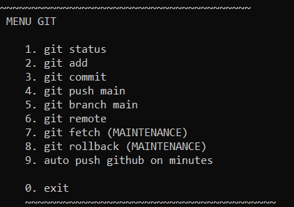

<h2>Github Auto Command </h2>
<hr>
<p>This script contains a menu that will make it easier for users to perform various github commands</p>

</img>

<h2>how to use</h2>
<hr>

1. download and extract
2. run command prompt and write

```
pip install requirements.txt
```
3. then run main.py
```
python main.py
```